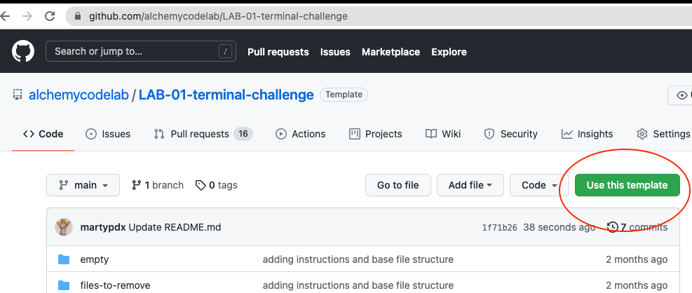

## Lab-01 Git & the Terminal

---

## Hint: Have the finder open while you do this!

## Setup

If you don't have a `~/alchemy` directory, go make one!

## Step by Step Instructions

1. Use this repo as a template:
   
1. Copy the url to your version of the template and clone it to your `~/alchemy` folder
   `git clone <your templated url>`
1. CD into your repo
   `cd terminal-challange-lab`
1. Use `ls` and `cd` to move around in the directory and also use your finder to compare what you're seeing in the terminal with what you're seeing in the finder.
1. We're now going to create some new files using the terminal -- create 2 new files in the `files-to-remove` directory with the echo command. The files should contain the following:
   |filename|text contents|
   |--|--|
   |files-to-remove/name.txt| My name is <your name> |
   |files-to-remove/foo-bar.txt | if foo then bar|
1. Move files from `files-to-remove` to `empty` with `mv`
1. Rename `empty` to `full` with `mv`.
1. Remove newly empty `files-to-remove` directory with `rmdir`
1. ACP your changes
1. Submit a link to your GitHub repo

## Points Break Down

| Looking For                                               | Points (10) |
| :-------------------------------------------------------- | ----------: |
| Url to your repo with proper file structure submitted on Canvas |          10 |
